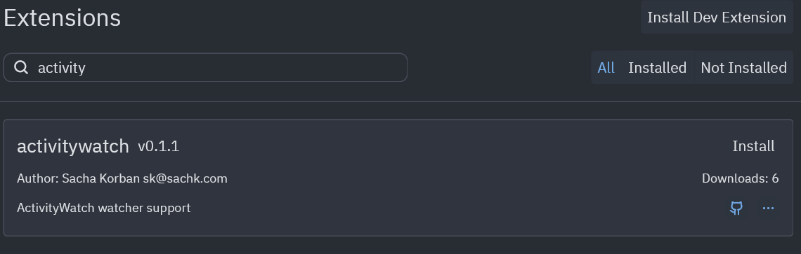

# aw-watcher-zed
This extension allows [ActivityWatch](https://activitywatch.net/), the free and open-source time tracker, to track what you are doing when using the [Zed](https://zed.dev/) editor.

## Installation
Search for activitywatch on Zed's extension page, (accessible from the command palette) and press install


## Configuration
This extension defaults to connecting to an ActivityWatch server at `http://127.0.0.1:5600`. To connect to a different server specify it by adding this to your Zed configuration.
```json
"lsp": {
  "activitywatch": {
    "settings": {
      "host": "192.168.0.10"
      "port": 5609
    }
  }
}
```
## Implementation Details
Uses the [activitywatch-ls](https://github.com/sachk/aw-watcher-zed/tree/main/activitywatch-ls) to receive edit events from Zed and send hearbeats to an ActivityWatch server using the [aw-client-rust](https://github.com/ActivityWatch/aw-server-rust/tree/master/aw-client-rust) library.

This is a not very nice hacky approach with a few issues, such as langauges not hardcoded into the extension in extension.toml not working and time looking at a file before changes not being counted without a complex workaround.

This plugin is heavily based on [the WakaTime plugin](https://github.com/wakatime/zed-wakatime) for Zed, thanks to them for making this a lot easier to figure out.
